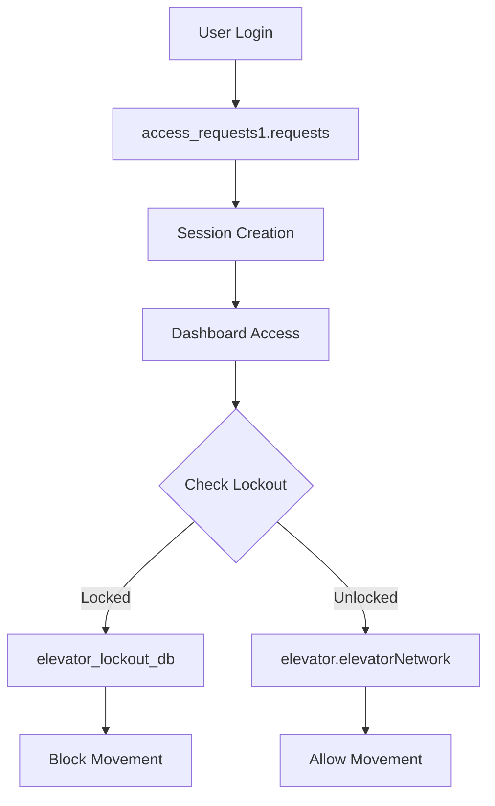
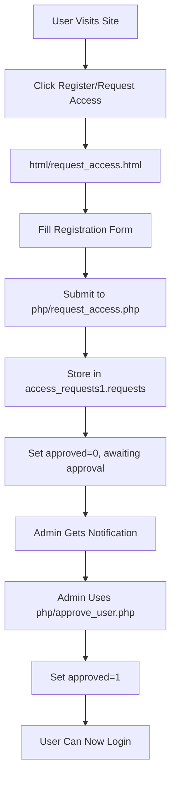
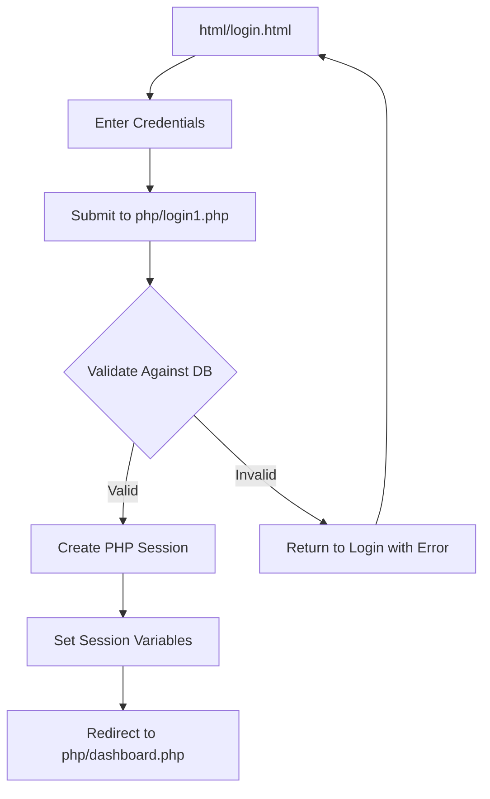
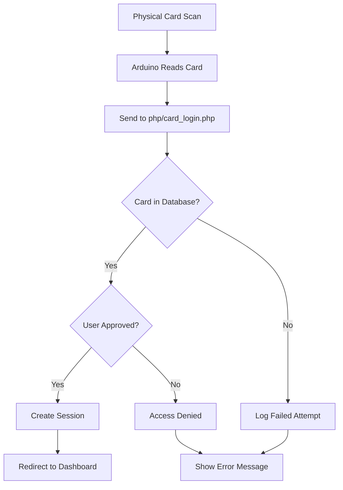
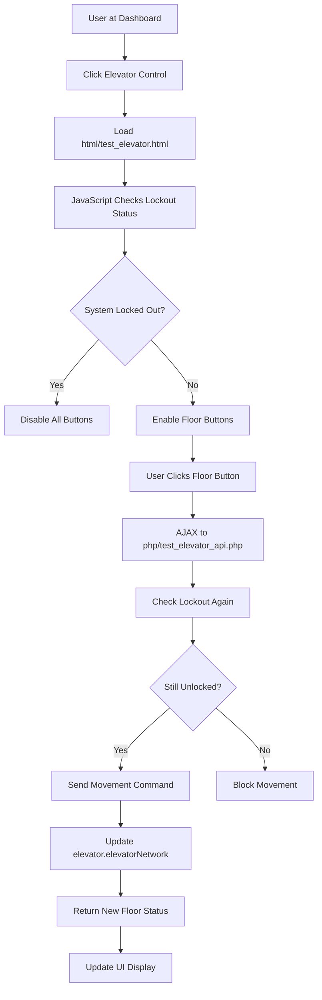
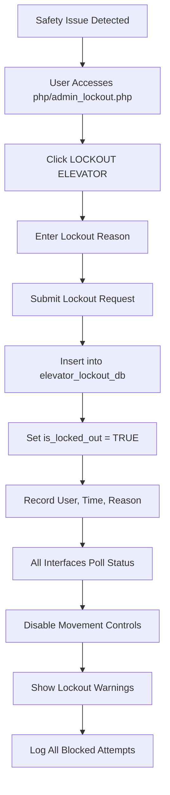
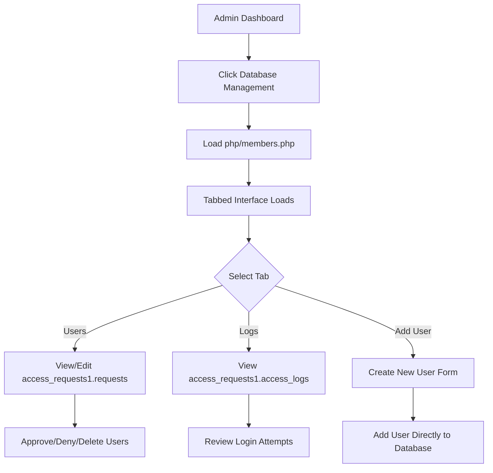
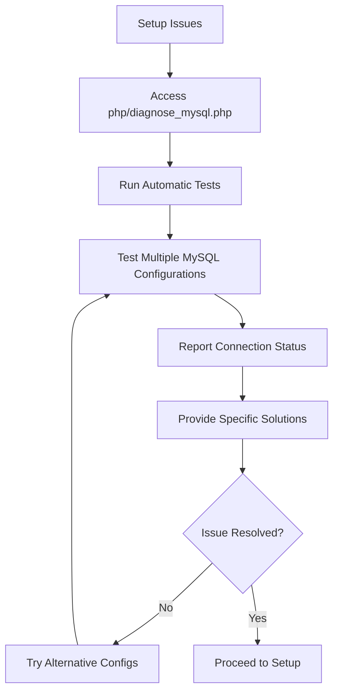

# 🚁 Elevator Control System with Advanced Safety & Management

> **A comprehensive web-based elevator control system featuring real-time control, multi-level authentication, lockout/tagout safety protocols, and complete user management.**

## 📋 Table of Contents
- [🚀 Quick Setup](#-quick-setup)
- [🔧 Troubleshooting](#-troubleshooting-guide)
- [📊 System Overview](#-system-overview)
- [🏗️ Architecture](#️-system-architecture)
- [🔐 Authentication](#-authentication-system)
- [🔒 Safety Features](#-lockouttagout-safety-system)
- [📁 Project Structure](#-complete-project-structure)
- [🌊 User Flows](#-complete-user-flows)
- [🛠️ Setup Options](#️-complete-setup-options)
- [💻 Development](#-development-guide)
- [📚 Usage Instructions](#-detailed-usage-instructions)

---

## 🚀 Quick Setup

### **🎯 FASTEST METHOD: One-Click Smart Setup**
1. **Start XAMPP** - Ensure Apache and MySQL are running
2. **Open Browser** - Navigate to: `http://localhost/projectsite/Elevator/php/smart_setup.php`
3. **Auto-Setup** - Click "Auto-Detect & Setup" button
4. **Login** - Use credentials: `Admin123` / `Admin123!`
5. **Dashboard** - Access main control at: `http://localhost/projectsite/Elevator/php/dashboard.php`

### **🔴 Common First-Time Issues**

#### **"Access Denied" Error (Most Common)**
```bash
# Quick Fix Options:
1. Use: diagnose_mysql.php (auto-detects issues)
2. Run: reset_mysql_password.bat (Windows)
3. Try: smart_setup.php (handles multiple configurations)
```

#### **"Can't Connect to MySQL"**
```bash
# Solution:
1. Open XAMPP Control Panel
2. Click "Start" next to MySQL
3. Wait for green "Running" status
4. Retry setup
```

### **🎮 Demo Credentials**
| Type | Username | Password | Access Level |
|------|----------|----------|--------------|
| **Admin** | `Admin123` | `Admin123!` | Full System Access |
| **Demo User** | `testuser1234567` | `password1234567` | Standard Access |

---

## 🔧 Troubleshooting Guide

### **🛠️ Setup Diagnostics**

#### **Smart Diagnostic Tools**
```bash
# Step 1: Auto-Diagnosis
http://localhost/projectsite/Elevator/php/diagnose_mysql.php

# Step 2: Database Structure Check  
http://localhost/projectsite/Elevator/php/check_database_structure.php

# Step 3: Smart Setup (Auto-Config)
http://localhost/projectsite/Elevator/php/smart_setup.php
```

#### **Manual MySQL Reset (Windows)**
```bash
# Method 1: Batch File
Run: reset_mysql_password.bat (as Administrator)

# Method 2: Command Line
cd C:\xampp\mysql\bin
mysqld --skip-grant-tables --skip-networking

# In new terminal:
mysql -u root
UPDATE mysql.user SET Password=PASSWORD('') WHERE User='root';
FLUSH PRIVILEGES;
EXIT;
```

### **🔍 Common Error Solutions**

| Error Code | Problem | Solution |
|------------|---------|----------|
| **1045** | Access denied | Use `diagnose_mysql.php` or reset password |
| **2002** | Can't connect | Start MySQL service in XAMPP |
| **1049** | Unknown database | Run setup scripts |
| **1146** | Table doesn't exist | Complete database setup |

---

## 📊 System Overview

### **🎯 Core Capabilities**
- **Real-Time Elevator Control** - Live floor movement with visual feedback
- **Multi-Authentication** - Manual login, card scanning, session management
- **Safety Lockout System** - Industry-standard LOTO (Lockout/Tagout) protocols
- **User Management** - Registration, approval workflow, access control
- **Live Dashboard** - Real-time monitoring with modern UI/UX
- **Arduino Integration** - Physical hardware control capabilities
- **Comprehensive Logging** - Complete audit trails for all actions

### **🌐 Web Interfaces**

#### **Main User Interfaces**
| Interface | URL | Purpose |
|-----------|-----|---------|
| **Dashboard** | `php/dashboard.php` | Main control center |
| **Login** | `html/login.html` | User authentication |
| **Elevator Control** | `html/test_elevator.html` | Direct elevator control |
| **Inside Control** | `php/index.php` | Interior elevator panel |
| **Outside Control** | `php/outside.php` | External call buttons |
| **Admin Lockout** | `php/admin_lockout.php` | Safety lockout controls |

#### **Management Interfaces**
| Interface | URL | Purpose |
|-----------|-----|---------|
| **User Requests** | `php/user_requests.php` | Approve new users |
| **Database Management** | `php/members.php` | Complete database admin |
| **Setup Center** | `php/setup_center.php` | System configuration |
| **Diagnostics** | `diagnostics/diagnostics.php` | Height & status monitoring |

---

## 🏗️ System Architecture

### **📊 Database Architecture**

#### **Primary Databases**
```sql
access_requests1          # User Management & Authentication
├── requests              # User accounts and credentials  
└── access_logs          # Login/access attempt logs

elevator_lockout_db      # Safety Lockout System
└── elevator_lockout     # Lockout status and audit trail

elevator                 # Real-Time Elevator Control
└── elevatorNetwork      # Current floor and movement data
```

#### **Database Relationships**


### **🔄 Real-Time Data Flow**
```
User Action → Authentication Check → Lockout Verification → Movement Command → Database Update → UI Refresh
     ↓               ↓                    ↓                    ↓                ↓             ↓
Login Form → PHP Session → MySQL Query → Elevator API → Floor Update → JavaScript Update
```

---

## 🔐 Authentication System

### **🔑 Multiple Authentication Methods**

#### **1. Manual Web Login**
```php
# Flow: html/login.html → php/login1.php → php/dashboard.php
Features:
- Username/password validation (7+ characters)
- Password hashing with PHP password_hash()
- Session management with login timestamps
- Login attempt logging
```

#### **2. Student Card Authentication**
```php
# Flow: Card Scan → php/card_login.php → php/dashboard.php
Features:
- Physical card reader integration
- Database validation against approved users
- Automatic session creation
- Real-time status updates
```

#### **3. Session Management**
```php
# Session Variables Stored:
$_SESSION['user_id']       # Unique user identifier
$_SESSION['username']      # Display name
$_SESSION['login_method']  # 'manual_login' or 'card_scan'
$_SESSION['login_time']    # Unix timestamp for session tracking
$_SESSION['email']         # User email (card logins)
$_SESSION['student_card']  # Card number (card logins)
```

### **🛡️ Security Features**
- **Password Requirements**: Minimum 7 characters for demo purposes
- **SQL Injection Protection**: Prepared statements throughout
- **Session Security**: Proper session management and cleanup
- **Access Control**: Page-level authentication checks
- **Login Logging**: Complete audit trail of all access attempts

---

## 🔒 Lockout/Tagout Safety System

### **🚨 Industrial Safety Standards**

#### **LOTO Protocol Implementation**
```php
# Safety Workflow:
1. LOCKOUT  → Disable all elevator movement
2. TAGOUT   → Document who, when, why  
3. VERIFY   → Confirm system is safe
4. WORK     → Perform maintenance
5. UNLOCK   → Restore normal operation
```

#### **Real-Time Safety Integration**
```javascript
// Every 2 seconds, check lockout status
setInterval(function() {
    fetch('test_elevator_api.php')
    .then(response => response.json())
    .then(data => {
        if (data.is_locked_out) {
            disableAllElevatorControls();
            showLockoutWarning(data.lockout_reason);
        }
    });
}, 2000);
```

### **🔧 Lockout Features**
- **One-Click Lockout**: Instant system disable from any interface
- **Mandatory Documentation**: Requires reason for lockout
- **User Accountability**: Tracks who performed lockout/unlock
- **Complete Audit Trail**: Timestamps and details for all actions
- **Multi-Interface Updates**: All control panels reflect status instantly
- **Movement Blocking**: API-level prevention of elevator commands

#### **Lockout Database Schema**
```sql
CREATE TABLE elevator_lockout (
    id INT PRIMARY KEY AUTO_INCREMENT,
    elevator_id INT DEFAULT 1,
    is_locked_out BOOLEAN NOT NULL,
    locked_by_user_id VARCHAR(50),
    locked_by_username VARCHAR(100),
    lockout_reason TEXT,
    lockout_timestamp TIMESTAMP DEFAULT CURRENT_TIMESTAMP,
    unlock_timestamp TIMESTAMP NULL,
    created_at TIMESTAMP DEFAULT CURRENT_TIMESTAMP
);
```

---

## 📁 Complete Project Structure

### **🗂️ Root Directory Layout**
```
Elevator/
├── 📄 index.php                    # Main elevator interface (inside view)
├── 📄 README.md                    # Complete documentation
├── 📄 DEMO_INSTRUCTIONS.md         # Quick demo guide
├── 📄 ProjectPlan.xlsx             # Project planning documents
├── 🔧 reset_mysql_password.bat     # Windows MySQL reset utility
└── 📄 card_login_status.txt        # Card reader communication file
```

### **📂 Directory Structure**

#### **`/php/` - Backend Logic (25+ files)**
```php
# Authentication & Sessions
login.php, login1.php           # Login processing  
check_card_login.php            # Card authentication
logout.php                      # Session cleanup
dashboard.php                   # Main control center

# User Management
register_user.php               # New user registration
request_access.php              # Access request processing
approve_user.php                # Admin approval interface
user_requests.php               # Approval management
members.php, members1.php       # Database administration

# Elevator Control
test_elevator_api.php           # Core movement API
index.php, inside.php           # Interior control panel
outside.php                     # External call buttons
elevator_api.php                # Alternative API endpoint

# Safety & Lockout
admin_lockout.php               # Main lockout interface
admin_lockout_simple.php        # Simplified lockout control
test_lockout_database.php       # Lockout system testing

# Setup & Diagnostics
smart_setup.php                 # Intelligent auto-setup
setup_all_databases.php         # Complete system setup
diagnose_mysql.php              # MySQL troubleshooting
check_database_structure.php    # Database verification
setup_center.php               # Configuration center

# Testing & Development
exception_test.php              # Error handling tests
elevator_exceptions.php         # Custom exception classes
quick_mysql_test.php           # Database connectivity test
```

#### **`/html/` - Frontend Interfaces (15+ files)**
```html
# Core Interfaces
login.html                      # Main login page
request_access.html             # User registration form
test_elevator.html              # Direct elevator control
test_lockout_integration.html   # Lockout testing interface

# Information Pages  
website.html                    # Project homepage
about.html                      # System information
proj_details.html               # Project details
deliverables.html               # Project deliverables

# Testing & Development
debug_status.html               # System status debugging
test_card_login.html            # Card authentication testing
test_card_system.html           # Card system testing
test_workflow.html              # Workflow testing
```

#### **`/css/` - Styling & Design (8+ files)**
```css
elevator.css                    # Main elevator styling
bootstrap.css                   # Bootstrap framework
projectsVI.css                  # Project-specific styles
960_12_col.css                  # Grid system
styleTest.css                   # Development styles
project_details_style.css       # Documentation styling
```

#### **`/sql/` - Database Setup Scripts (9+ files)**
```sql
# Complete Setup
complete_setup.sql              # Full system setup
fresh_setup.sql                 # Clean installation
setup_access_requests.sql       # User management DB
setup_lockout_database.sql      # Safety system DB  
elevator_network_database.sql   # Movement control DB

# Individual Components
simple_setup.sql               # Basic lockout setup
create_lockout_table.sql        # Lockout table only
add_admin_to_existing.sql       # Add admin user
phpmyadmin_setup.sql           # phpMyAdmin setup
```

#### **`/classes/` - PHP OOP Framework (3 files)**
```php
Node.php                        # Base node class
FloorNode.php                   # Floor management class  
ElevatorCar.php                 # Elevator object class
```

#### **`/arduino/` - Hardware Integration**
```
Amy_Elevator/                   # Student elevator project
cardReader/                     # Card reader code
Elevator Controller Arduino Code/ # Main Arduino control
```

#### **`/audio/` - Sound Effects**
```
Floor1.mp3, Floor2.mp3, Floor3.mp3  # Floor arrival sounds
teto.mp3                            # Demo audio
```

#### **Additional Directories**
```
/diagnostics/     # System diagnostics and monitoring
/documents/       # Project documentation (PDFs)
/images/          # UI images and graphics
/json/            # JSON data files
/logbooks/        # Developer logbooks and notes
/testPlan/        # Testing documentation
/uml/             # UML diagrams and models
/videos/          # Demo and instructional videos
/jsdoom-dosbox/   # Embedded game (JS DOOM)
```

---

## 🌊 Complete User Flows

### **🔐 Authentication Flows**

#### **Flow 1: New User Registration**


#### **Flow 2: Manual Login Process**


#### **Flow 3: Card Authentication**


### **🚁 Elevator Control Flows**

#### **Flow 4: Standard Elevator Operation**


#### **Flow 5: Emergency Lockout Process**


### **🛠️ Administrative Flows**

#### **Flow 6: User Management Workflow**


### **🔍 Diagnostic & Testing Flows**

#### **Flow 7: System Diagnostics**


---

## 🛠️ Complete Setup Options

### **🎯 Setup Method Comparison**

| Method | Speed | Skill Level | Use Case |
|--------|-------|-------------|----------|
| **Smart Setup** | ⚡ 2 min | Beginner | New installations |
| **Complete Setup** | ⚡ 3 min | Beginner | Fresh systems |
| **Manual Setup** | 🐌 10 min | Advanced | Custom configurations |
| **phpMyAdmin** | 🐌 15 min | Expert | Existing database systems |

### **🚀 Option 1: Smart Setup (Recommended)**
```bash
# Automatic detection and configuration
URL: http://localhost/projectsite/Elevator/php/smart_setup.php

Features:
✅ Auto-detects MySQL configuration
✅ Handles multiple root password scenarios  
✅ Creates all databases and tables
✅ Sets up default admin user
✅ Provides verification and next steps
✅ Error handling with specific solutions
```

### **🏗️ Option 2: Complete Database Setup**
```bash
# One-click setup for all system components
URL: http://localhost/projectsite/Elevator/php/setup_all_databases.php

Creates:
📊 access_requests1 (user management)
🔒 elevator_lockout_db (safety system)
🚁 elevator (movement control)
👤 Default admin user (Admin123/Admin123!)
```

### **🔧 Option 3: Individual Component Setup**
```bash
# Setup individual databases as needed

# User Management Only:
URL: php/setup_lockout_db.php
SQL: sql/setup_access_requests.sql

# Safety System Only:  
URL: php/setup_lockout_db.php
SQL: sql/simple_setup.sql

# Movement Control Only:
SQL: sql/elevator_network_database.sql
```

### **🛠️ Option 4: Manual SQL Setup**
```sql
-- Use phpMyAdmin or MySQL command line

-- Step 1: User Management
SOURCE sql/setup_access_requests.sql;

-- Step 2: Safety System
SOURCE sql/simple_setup.sql;

-- Step 3: Movement Control  
SOURCE sql/elevator_network_database.sql;

-- Step 4: Default Admin
SOURCE sql/add_admin_to_existing.sql;
```

### **⚙️ Setup Configuration Details**

#### **Database Credentials Tested**
```php
# Smart setup tests these configurations automatically:
1. root / (no password) - Default XAMPP
2. root / root - Common alternative
3. root / password - Standard setup
4. root / mysql - Another common setup
5. Custom user credentials
```

#### **Post-Setup Verification**
```bash
# Verification URLs:
Database Structure: php/check_database_structure.php
MySQL Diagnostics: php/diagnose_mysql.php  
System Status: html/debug_status.html
```

---

## 💻 Development Guide

### **🏗️ Architecture Patterns**

#### **MVC-Style Organization**
```php
# Model Layer (Database)
/sql/                   # Database schemas
/classes/               # PHP OOP models

# View Layer (Frontend)
/html/                  # Static templates
/css/                   # Styling
/php/ (UI components)   # Dynamic views

# Controller Layer
/php/ (API endpoints)   # Business logic
```

#### **API Design Pattern**
```php
# RESTful-style endpoints
test_elevator_api.php   # Main elevator control API
admin_lockout.php       # Lockout management API
check_card_login.php    # Authentication API

# Request/Response Format:
Request:  POST with JSON or form data
Response: JSON with status and data
```

### **🔧 Key Development Files**

#### **Core PHP Classes**
```php
# /classes/Node.php - Base elevator node
class Node {
    protected int $id;
    protected int $floor;
    
    public function __construct(int $floor) {
        $this->floor = $floor;
        $this->id = uniqid();
    }
    
    public function getFloor(): int { return $this->floor; }
    public function setFloor(int $floor): void { $this->floor = $floor; }
}

# /classes/ElevatorCar.php - Elevator logic
class ElevatorCar extends Node {
    private string $status;
    private static int $totalElevators = 0;
    
    public function moveToFloor(int $targetFloor): void {
        // Movement logic with database updates
    }
}
```

#### **Database Connection Patterns**
```php
# User Database Connection
$user_mysqli = new mysqli("localhost", "Blaise", "Gitdead32!32", "access_requests1");

# Lockout Database Connection  
$lockout_db = new PDO('mysql:host=localhost;dbname=elevator_lockout_db', 'root', '');

# Elevator Database Connection
$elevator_db = new PDO('mysql:host=127.0.0.1;dbname=elevator','ese','ese');
```

#### **JavaScript Integration Patterns**
```javascript
// Real-time polling pattern
setInterval(function() {
    fetch('test_elevator_api.php')
    .then(response => response.json())
    .then(data => updateUI(data));
}, 2000);

// AJAX command pattern
function sendElevatorCommand(floor) {
    fetch('test_elevator_api.php', {
        method: 'POST',
        headers: {'Content-Type': 'application/x-www-form-urlencoded'},
        body: `action=move&floor=${floor}`
    })
    .then(response => response.json())
    .then(data => handleResponse(data));
}
```

### **🎨 Frontend Development**

#### **CSS Framework Structure**
```css
/* Modern glass morphism design */
.glass-card {
    background: rgba(255, 255, 255, 0.95);
    backdrop-filter: blur(10px);
    border-radius: 20px;
    box-shadow: 0 20px 40px rgba(0, 0, 0, 0.1);
}

/* Responsive grid layouts */
.dashboard-grid {
    display: grid;
    grid-template-columns: repeat(auto-fit, minmax(320px, 1fr));
    gap: 25px;
}
```

#### **Interactive UI Components**
```javascript
// Button ripple effects
function addRippleEffect(button) {
    button.addEventListener('click', function(e) {
        const ripple = document.createElement('div');
        ripple.className = 'ripple';
        this.appendChild(ripple);
        setTimeout(() => ripple.remove(), 600);
    });
}

// Live time updates
function updateTimes() {
    const now = new Date();
    document.getElementById('current-time').textContent = 
        now.toLocaleTimeString('en-GB', {hour12: false});
}
setInterval(updateTimes, 1000);
```

### **🔍 Testing & Debugging**

#### **Debug Interfaces**
```bash
# Development Testing URLs:
Exception Testing: php/exception_test.php
Database Testing: php/test_database.php  
Lockout Testing: html/test_lockout_integration.html
Card System Testing: html/test_card_system.html
```

#### **Error Handling Patterns**
```php
# Comprehensive error handling
try {
    $db = new PDO($dsn, $user, $pass);
    $db->setAttribute(PDO::ATTR_ERRMODE, PDO::ERRMODE_EXCEPTION);
} catch (PDOException $e) {
    error_log("Database connection failed: " . $e->getMessage());
    return ['error' => 'Database connection failed'];
}
```

---

## 📚 Detailed Usage Instructions

### **👤 For End Users**

#### **Getting Started**
1. **Access System**: Navigate to `http://localhost/projectsite/Elevator/`
2. **Login**: Use provided credentials or register for new account
3. **Dashboard**: Main control center with all system access
4. **Elevator Control**: Access elevator controls via dashboard links

#### **Daily Operations**
```bash
# Normal Elevator Use:
1. Login to system
2. Access elevator control interface
3. Select desired floor
4. Monitor real-time status
5. System logs all activity

# Emergency Procedures:
1. Access admin lockout immediately  
2. Enter detailed reason for lockout
3. System blocks all movement
4. Perform necessary maintenance
5. Unlock when safe to resume
```

### **👨‍💼 For Administrators**

#### **User Management Tasks**
```bash
# Approve New Users:
1. Navigate to php/user_requests.php
2. Review pending requests
3. Approve or deny applications
4. Users receive immediate access

# Database Administration:
1. Access php/members.php
2. Use tabbed interface for:
   - User account management
   - Access log review  
   - Direct database editing
```

#### **System Maintenance**
```bash
# Regular Maintenance:
1. Review lockout logs for safety compliance
2. Monitor user access patterns
3. Check system diagnostics
4. Update user permissions as needed

# Emergency Procedures:
1. Immediate lockout capability from any interface
2. Complete audit trail review
3. System status verification
4. Coordinated unlock procedures
```

### **🛠️ For Developers**

#### **Development Environment Setup**
```bash
# Local Development:
1. Clone/download project to htdocs
2. Start XAMPP (Apache + MySQL)
3. Run smart_setup.php for auto-configuration
4. Access development tools and debug interfaces

# Code Organization:
- PHP backend in /php/ directory
- Frontend templates in /html/ directory  
- Styling in /css/ directory
- Database schemas in /sql/ directory
```

#### **Customization Points**
```php
# Authentication System:
- Modify password requirements in login1.php
- Add additional authentication methods
- Customize session management

# UI/UX Customization:
- Update CSS for branding/styling
- Modify dashboard layout and components
- Add additional monitoring interfaces

# Safety System Extensions:
- Add additional lockout reasons/categories
- Implement multi-level approval workflows
- Extend audit logging capabilities
```

#### **Integration Opportunities**
```bash
# Arduino Integration:
- Physical elevator control hardware
- Card reader systems
- Sensor monitoring and feedback

# External System Integration:
- Building management systems
- Access control integration
- Emergency notification systems
```

---

## 🔄 System Flows Summary

### **🎯 Critical Success Paths**
1. **Setup Success**: Smart setup → Database creation → Admin login → Dashboard access
2. **User Success**: Registration → Approval → Login → Elevator control
3. **Safety Success**: Lockout trigger → Movement blocking → Maintenance → Safe unlock

### **🛡️ Security & Safety Features**
- **Multi-layer Authentication**: Manual, card, session management
- **Industrial Safety Standards**: LOTO protocol compliance
- **Complete Audit Trails**: Every action logged with user and timestamp
- **Real-time Monitoring**: Live status updates across all interfaces
- **Emergency Procedures**: Immediate lockout capability from any interface

### **⚡ Performance & Scalability**
- **Efficient Database Design**: Optimized queries and indexing
- **Real-time Updates**: JavaScript polling with minimal overhead
- **Responsive Design**: Works on desktop, tablet, and mobile devices
- **Modular Architecture**: Easy to extend and customize

---

*This elevator control system provides a complete, professional-grade solution suitable for educational environments, demonstration purposes, and real-world industrial applications with appropriate hardware integration.*
